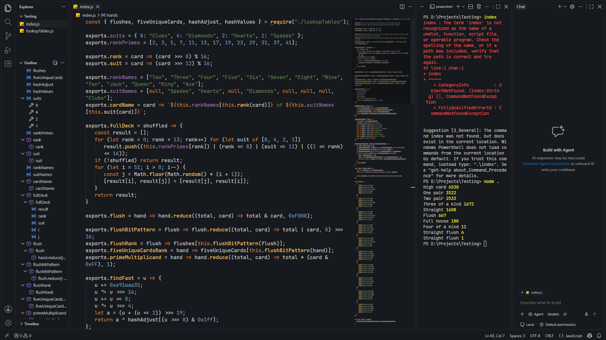

NOTE: You don't need ```settings.json``` anymore if you don't want to use it, since custom syntax highlighting no longer lives there. Just drop ```theme.json``` into whichever theme you installed, and it should work.

I have found the editor settings in my ```settings.json``` to provide the best overall visual coherence with this theme. They are not required, but I recommend using them for the intended appearance and experience.



Code shown in the preview was sourced from [cactus-josh](https://github.com/josh-frank/cactus-josh)

```jsonc
// these were added on later
"minimap.selectionOccurrenceHighlight": "#8091aa40" // has some weird alpha layering
"minimapSlider.background": "#00000040"
"minimapSlider.hoverBackground": "#00000040"
"minimapSlider.activeBackground": "#00000040"
```
